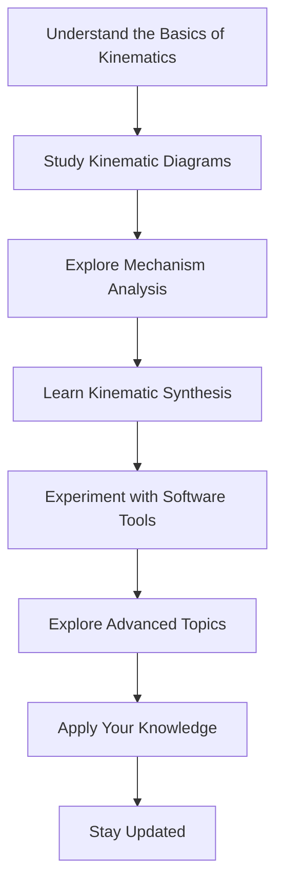

# Roadmap: Studying Kinematic Design

## 1. Understand the Basics of Kinematics:
- Grasp fundamental concepts like position, velocity, acceleration, and time.
- Learn about linear, rotational, and combined motion.
- Familiarize with key terminology.
  - **Resources**: [Textbook: "Engineering Mechanics: Dynamics" by J.L. Meriam and L.G. Kraige], [Online Course: Khan Academy - Physics > AP Physics 1 > Linear motion], [YouTube Channel: Michel van Biezen - Kinematics Playlist]

## 2. Study Kinematic Diagrams:
- Learn to create and interpret kinematic diagrams.
- Practice drawing diagrams for various mechanisms.
- Understand their role in analyzing motion.
  - **Resources**: [Textbook: "Mechanical Engineering Design" by J.E. Shigley and C.R. Mischke], [Website: TeachEngineering - Introduction to Mechanisms], [Software Tutorial: SolidWorks Motion Tutorial Series]

## 3. Explore Mechanism Analysis:
- Study velocity and acceleration analysis.
- Learn graphical, analytical, and numerical methods.
- Solve problems to apply analysis techniques.
  - **Resources**: [Textbook: "Theory of Machines and Mechanisms" by J.J. Uicker, G.R. Pennock, and J.E. Shigley], [Online Course: Coursera - Robotics: Kinematics and Mathematical Foundations], [Software Documentation: MATLAB Documentation - SimMechanics]

## 4. Learn Kinematic Synthesis:
- Understand designing mechanisms for specific motion requirements.
- Explore design parameters and synthesis techniques.
- Practice designing mechanisms using different methods.
  - **Resources**: [Textbook: "Kinematics and Dynamics of Machinery" by Charles E. Wilson and J. Peter Sadler], [Research Papers: IEEE Xplore - Kinematic Synthesis], [Software Tutorial: Autodesk Inventor - Designing Mechanisms Tutorial Series]

## 5. Experiment with Software Tools:
- Utilize CAD and simulation software.
- Explore software packages for kinematic analysis.
- Model and simulate mechanical systems.
  - **Resources**: [Software: MATLAB, SolidWorks, Autodesk Inventor], [Tutorial: Udemy Course - Mastering SolidWorks Motion], [Online Platform: SimScale - Kinematic Analysis Tutorials]

## 6. Explore Advanced Topics:
- Study dynamics, trajectory planning, and motion control.
- Learn about forces, torques, and dynamic analysis.
- Explore trajectory planning algorithms and motion control strategies.
  - **Resources**: [Textbook: "Robot Modeling and Control" by Mark W. Spong, Seth Hutchinson, and M. Vidyasagar], [Research Journal: Journal of Mechanisms and Robotics], [Online Course: edX - Advanced Motion Control]

## 7. Apply Your Knowledge:
- Solve practical engineering problems.
- Work on projects requiring kinematic mechanism design.
- Gain experience through collaboration and real-world applications.
  - **Resources**: [Project Ideas: IEEE Robotics & Automation Magazine], [Industry Reports: Robotics Industry Association (RIA) Publications], [Community: Reddit - r/MechanicalEngineering]

## 8. Stay Updated:
- Read academic journals and attend conferences.
- Participate in online forums.
- Continuously expand your knowledge and skills.
  - **Resources**: [Academic Journals: ASME Journal of Mechanisms and Robotics], [Conferences: IEEE/RSJ International Conference on Intelligent Robots and Systems (IROS)], [Online Forums: Engineering Stack Exchange - Robotics Tag]

By following this roadmap and utilizing the suggested resources, you can develop a solid foundation in kinematic design and become proficient in designing, analyzing, and optimizing mechanical systems for various applications.
